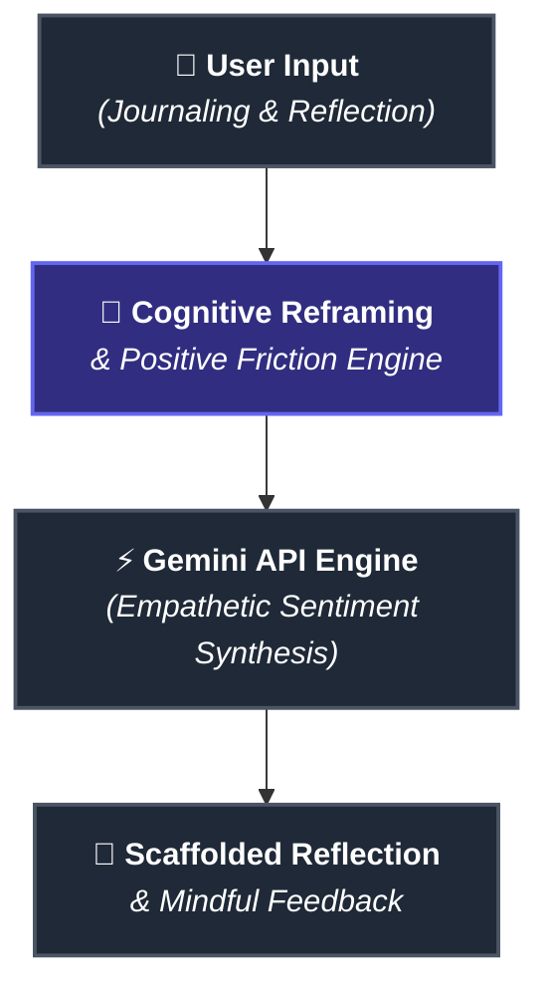

# mana-companion_2
"AI-Powered Cognitive Scaffolding &amp; Empathetic Interaction Companion"
# 🌿 Mana | AI-Powered Cognitive Scaffolding Companion

<p align="center">
  
  
  
  
</p>

<p align="center">
  <b>Reimagining human-AI dialogue through Cognitive Psychology, Positive Friction, and Empathetic System Design.</b>
</p>

---

## 💡 The Core Question

> *"What happens when AI doesn't just answer instantly, but actively invites you to pause, reflect, and think deeper?"*

Most generative AI tools optimize strictly for **speed and automated answers**. While efficient, this often leads to **cognitive passivity** and emotional overload.

**Mana** flips this paradigm. Designed at the intersection of **Psychology and Generative AI**, Mana acts as a **Cognitive Scaffold**—a digital sanctuary that introduces intentional, human-centered friction to nurture deep self-reflection.

---

## ✨ Why Mana is Different

| Traditional AI Assistants 🤖 | Mana Cognitive Companion 🌿 |
| :--- | :--- |
| **Instant Output:** Immediate answer dumping | **Positive Friction:** Guided pauses for deeper emotional processing |
| **Transactional:** Task-oriented execution | **Empathetic Synthesis:** Mood-aware AI dialogue & active listening |
| **Creates Dependency:** AI thinks *for* the user | **Cognitive Scaffolding:** AI helps *the user* think for themselves |

---

## 🧠 Psychological Frameworks Implemented

### 1. 🧘 Positive Friction & Cognitive Load Control
Rather than bombarding users with immediate dense text, Mana introduces intentional breathing pulses and structured input stages. This prevents emotional overwhelm and triggers metacognition.

### 2. 🪜 Cognitive Scaffolding (Bruner's Theory)
Mana provides temporary conversational "scaffolds"—guiding questions that help users reframe negative cognitive distortions without doing the emotional work *for* them.

---
## 🏗️ System Architecture




```


## 🚀 Technical Stack
​AI Engine: Google Gemini API (Multi-turn conversational model)
​Deployment: Google Cloud Run & Docker
​Backend & UI: Python / Streamlit / FastAPI
​Data & Security: Privacy-first user data handling
​👩‍💻 Author & Research Focus
​Zahra Khorram
Psychology Student & Human-AI Interaction (HAI) Researcher
Focused on Cognitive Load Reduction, Empathetic AI, and Ethical User Experience Design.
​📫 Connect with me: LinkedIn Profile https://www.linkedin.com/in/zahra-khorram-9a73a6423?utm_source=share_via&utm_content=profile&utm_medium=member_android | Read full Case Study on Medium
